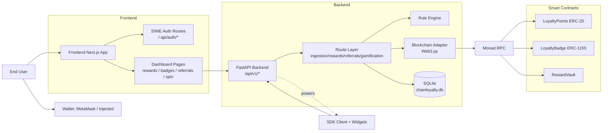
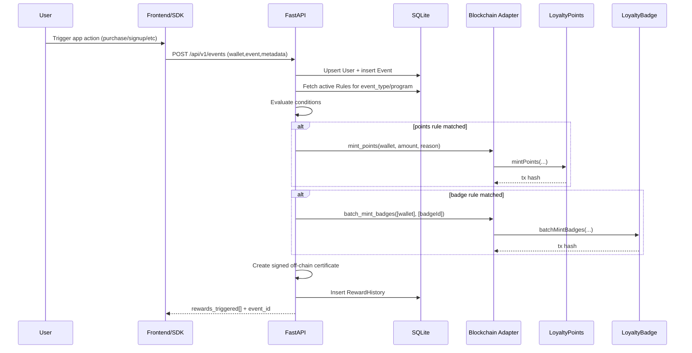
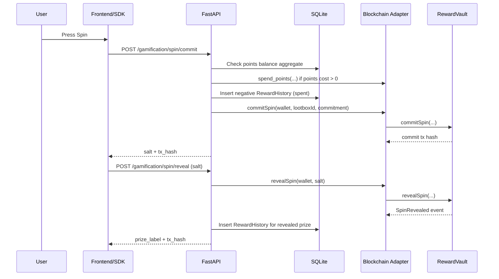

# LoyaltyChain High-Level Architecture README

This document is designed to help you create a high-level architecture diagram for the LoyaltyChain project quickly and accurately.

It covers:
- System boundaries and major runtime components
- External dependencies and trust boundaries
- Core APIs and event/reward lifecycle
- On-chain/off-chain split of responsibilities
- Diagram-ready Mermaid templates

---

## 1. System Scope

LoyaltyChain is a Web3 loyalty platform with four primary layers:

1. Frontend App (`frontend/`)
2. Backend API + reward engine (`backend/`)
3. Smart contracts + deployment tooling (`blockchain/`)
4. Embeddable SDK for third-party apps (`sdk/`)

### Supporting/secondary folders
- `example/`, `example2/`: integration examples
- Root scripts/docs (`plan.md`, etc.): planning and notes

---

## 2. Architecture At A Glance

### Core idea
- User identity and UX live in the frontend (SIWE session + dashboard UI).
- Rule evaluation and reward orchestration live in the backend.
- Durable reward assets and game mechanics live on-chain.
- Fast queryability and analytics-like views live in SQLite (off-chain DB).
- SDK exposes the same backend capabilities as reusable components/client APIs.

### Runtime split
- **Off-chain control plane**: FastAPI + SQLModel + Python blockchain adapter.
- **On-chain execution plane**: LoyaltyPoints (ERC-20), LoyaltyBadge (ERC-1155), RewardVault (lootbox/spin).

---

## 3. Component Inventory

## 3.1 Frontend (`frontend/`)

### Responsibilities
- Wallet connection (wagmi + MetaMask/injected connectors)
- SIWE authentication via Next.js API routes and iron-session cookies
- Loyalty dashboards: rewards stats, badges, referrals, leaderboard, spin wheel, admin rules UI
- Direct backend calls to FastAPI endpoints (`http://localhost:8000/api/v1/...` currently hardcoded in multiple pages)

### Key modules
- Auth context: `frontend/lib/auth-context.tsx`
- SIWE/session routes:
  - `frontend/app/api/auth/nonce/route.ts`
  - `frontend/app/api/auth/verify/route.ts`
  - `frontend/app/api/auth/session/route.ts`
- Dashboard pages (examples):
  - `frontend/app/dashboard/page.tsx`
  - `frontend/app/dashboard/spin/page.tsx`
  - `frontend/app/dashboard/referrals/page.tsx`
  - `frontend/app/dashboard/badges/page.tsx`
  - `frontend/app/dashboard/leaderboard/page.tsx`

## 3.2 Backend (`backend/`)

### Responsibilities
- Route auto-discovery and API hosting via FastAPI
- Event ingestion + rule evaluation
- Reward history persistence and aggregation
- Referral graph and referral rewards
- Spin commit/reveal orchestration with RewardVault
- On-chain transactions through Web3.py adapter

### Entry and infrastructure
- API entrypoint: `backend/server.py`
- DB models and engine: `backend/database.py`
- Blockchain adapter: `backend/lib/blockchain.py`

### Data model (SQLite)
- `User`: wallet identity, referral code, referred_by, program_id
- `Event`: ingested activity events and metadata
- `Rule`: event->reward automation rules
- `RewardHistory`: earned/minted/spent/claimed rewards with tx and certificate metadata

## 3.3 Smart contracts (`blockchain/`)

### Contracts
- `LoyaltyPoints.sol` (ERC-20 points)
  - mint/spend/batch operations
  - per-program accounting
  - role-gated mint/burn/management
- `LoyaltyBadge.sol` (ERC-1155 badges)
  - badge type registry
  - direct mint and EIP-712 signature-based user claims
  - optional soulbound behavior per badge type
- `RewardVault.sol` (lootbox/spin engine)
  - weighted prize tables
  - commit/reveal randomness scheme
  - spin gating (points/native cost, cooldown, max spins)

### Deployment/tooling
- Hardhat + scripts in `blockchain/scripts/`
- Combined deployment script: `blockchain/scripts/deployAll.js`
- ABI sync utility for backend: `backend/sync_abis.py`

## 3.4 SDK (`sdk/`)

### Responsibilities
- Reusable JS/TS client for backend endpoints
- React hooks for query/mutation flows
- Drop-in UI widgets for rewards, leaderboard, referrals, spin, quests, tiers, store

### Key module
- `sdk/src/client/ChainLoyaltyClient.ts`

### Important note
- SDK endpoint contract and backend implementation are mostly aligned but not perfectly identical in a few places (example: auth-style endpoints in SDK vs frontend SIWE route style).

---

## 4. API Surface To Show In Diagram

Backend routes are grouped by feature prefixes:

- `/api/v1/events` (ingestion)
  - `POST /api/v1/events`

- `/api/v1/rewards`
  - `GET /api/v1/rewards/{wallet_address}/stats`
  - `GET /api/v1/rewards/{wallet_address}/history`
  - `GET /api/v1/rewards/leaderboard`
  - `GET /api/v1/rewards/certificate/{reward_id}`
  - `POST /api/v1/rewards/{wallet_address}/claim/{badge_id}`

- `/api/v1/referrals`
  - `POST /api/v1/referrals/verify`
  - `GET /api/v1/referrals/code/{wallet_address}`
  - `GET /api/v1/referrals/{wallet_address}/list`

- `/api/v1/gamification`
  - `GET /api/v1/gamification/lootbox/{lootbox_id}/config`
  - `POST /api/v1/gamification/spin/commit`
  - `POST /api/v1/gamification/spin/reveal`
  - `POST /api/v1/gamification/purchase`

Plus:
- `GET /` health route
- `GET /sample` sample route

---

## 5. End-To-End Flow Summaries

## 5.1 SIWE auth (frontend-only gateway)

1. Frontend requests nonce from Next route (`/api/auth/nonce`).
2. User signs SIWE message in wallet.
3. Frontend posts message + signature to `/api/auth/verify`.
4. Next route validates SIWE and stores session in iron-session cookie.
5. Frontend uses session state and connected wallet for dashboard access.

## 5.2 Event ingestion -> rule evaluation -> reward

1. Client sends `wallet_address`, `event_type`, metadata to `POST /api/v1/events`.
2. Backend normalizes checksum address and ensures `User` exists.
3. Event stored in `Event` table.
4. Matching `Rule` rows are evaluated.
5. For matched rules:
   - points reward -> `mint_points(...)` on-chain
   - badge reward (auto mint) -> `batch_mint_badges(...)` on-chain
6. Backend signs off-chain reward certificate.
7. `RewardHistory` appended and response returns triggered rewards.

## 5.3 Spin wheel (commit-reveal)

1. Client requests lootbox config from backend.
2. Client starts spin via `POST /spin/commit`.
3. Backend checks points cost, burns points on-chain if needed, logs negative reward history.
4. Backend generates salt + commitment and submits `commitSpin(...)` to RewardVault.
5. After delay, client calls `POST /spin/reveal` with salt.
6. Backend reveals on-chain, parses prize event, records reward in `RewardHistory`.

## 5.4 Badge claim with EIP-712 signature

1. User earned badge exists in DB (`RewardHistory`).
2. Frontend/backend requests claim payload from `POST /rewards/{wallet}/claim/{badge_id}`.
3. Backend returns signature + nonce + expiry payload.
4. User submits claim tx to `LoyaltyBadge.claimBadge(...)`.

---

## 6. Trust Boundaries And Security-Relevant Zones

When drawing, separate these zones clearly:

1. **Untrusted client zone**
   - Browser UI, wallet extension, SDK consumers

2. **Application trust zone**
   - Next.js app server routes (SIWE session handling)
   - FastAPI backend and signing key runtime

3. **Data persistence zone**
   - SQLite database (`chainloyalty.db`)

4. **Blockchain trust zone**
   - Monad RPC and deployed contracts

5. **Secrets zone**
   - Private keys, session secrets, contract addresses, RPC credentials in env vars

### Important caveat to annotate
- Frontend uses SIWE sessions, but many backend endpoints currently accept wallet params directly without server-side SIWE session enforcement.

---

## 7. Suggested Diagram Set

Use these three diagrams for stakeholders:

1. **System Context Diagram**
   - Shows users, wallet, frontend, backend, contracts, DB, RPC.
2. **Container/Service Diagram**
   - Splits frontend modules, backend routes/reward engine/blockchain adapter, contracts.
3. **Sequence Diagram (Event -> Reward + Spin)**
   - Shows dynamic runtime path and on-chain side effects.

---

## 8. Mermaid: System Context Diagram



---

## 9. Mermaid: Container/Service Diagram

```mermaid
flowchart TB
  subgraph Client Tier
    UI[Next.js UI]
    SDKC[Third-party App using SDK]
    WAL[Wallet Provider]
  end

  subgraph App Tier
    AUTH[SIWE Session API\nnonce/verify/session]
    API[FastAPI Service\nserver.py]
  end

  subgraph Domain Tier (Backend)
    ING[Ingestion Route]
    REW[Rewards Route]
    REF[Referrals Route]
    GAM[Gamification Route]
    RULE[Rule Evaluation]
    BCA[Blockchain Client Adapter]
  end

  subgraph Data Tier
    DB[(SQLite: User/Event/Rule/RewardHistory)]
  end

  subgraph Chain Tier
    LP[LoyaltyPoints]
    LB[LoyaltyBadge]
    RV[RewardVault]
    RPC[Monad RPC]
  end

  UI --> AUTH
  UI --> API
  SDKC --> API
  UI <--> WAL

  API --> ING
  API --> REW
  API --> REF
  API --> GAM

  ING --> RULE
  ING --> DB
  REW --> DB
  REF --> DB
  GAM --> DB

  ING --> BCA
  REW --> BCA
  REF --> BCA
  GAM --> BCA

  BCA --> RPC
  RPC --> LP
  RPC --> LB
  RPC --> RV
```

---

## 10. Mermaid: Sequence Diagram (Event + Reward)



---

## 11. Mermaid: Sequence Diagram (Spin Commit-Reveal)



---

## 12. Deployment/Environment Nodes To Include

When drawing infra-level high-level architecture, include these env/config artifacts:

- Backend env
  - `RPC_URL`, `PRIVATE_KEY`, `CHAIN_ID`
  - `LOYALTY_POINTS_ADDR`, `LOYALTY_BADGE_ADDR`, `REWARD_VAULT_ADDR`

- Frontend env
  - `SESSION_SECRET`
  - `NEXT_PUBLIC_LOYALTY_BADGE_ADDR` (and related chain/contract vars as used)

- Build/runtime
  - FastAPI (`uvicorn server:app --reload --port 8000`)
  - Next.js frontend
  - Hardhat deployment scripts

---

## 13. Diagram Checklist (Before Finalizing)

Use this checklist to ensure your diagram is complete:

- [ ] Shows both frontend SIWE auth path and backend API path
- [ ] Shows DB as separate persistence component
- [ ] Shows all 3 contracts and RPC boundary
- [ ] Shows backend blockchain adapter as distinct box
- [ ] Shows SDK as alternative client path into backend
- [ ] Distinguishes off-chain certificates vs on-chain txs
- [ ] Includes trust boundaries (client/app/chain/secrets)
- [ ] Notes current auth caveat for backend wallet-param endpoints

---

## 14. Recommended Audience Variants

- **Executive/PM version**: use Section 8 only (system context).
- **Engineering onboarding version**: use Sections 8 + 9 + 10.
- **Security/design review version**: use Sections 9 + 10 + 11 + trust boundaries.

---

## 15. Current Known Gaps (Annotate as "Future Hardening")

For architecture review transparency, add a small annotation block in your diagram:

1. Centralized backend signing key for chain actions (single trust anchor).
2. Backend route-level auth hardening can be strengthened to match SIWE session model.
3. SQLite is simple for hackathon/small deployments; production may migrate to managed DB.
4. Commit-reveal RNG in RewardVault is suitable for current scope; high-value production may prefer oracle-backed randomness.

---

If you want, the next step is a polished C4-style version of these diagrams (Context + Container + Component) tailored for Miro, Excalidraw, or Lucidchart.